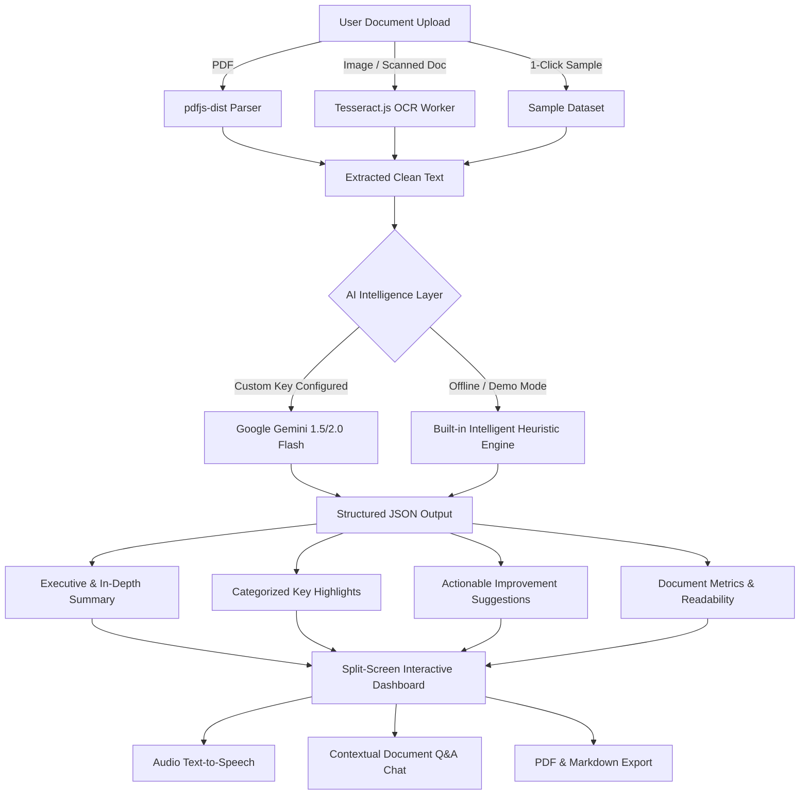

# 📑 Document Summary Assistant (DocuSummarizer AI)

[](https://reactjs.org/)
[](https://www.typescriptlang.org/)
[](https://vitejs.dev/)
[](https://tailwindcss.com/)
[](https://aistudio.google.com/)
[](https://tesseract.projectnaptha.com/)
[](https://opensource.org/licenses/MIT)

> A modern, production-grade web application that extracts text from any document (**PDFs** and **scanned images via OCR**), generates **smart multi-depth summaries**, extracts **categorized key highlights**, provides **actionable document improvement suggestions**, and enables **interactive document Q&A**.

---

## 📌 Approach Write-Up (Technical Assessment)

> **Architectural & Problem-Solving Approach (under 200 words):**
> 
> To deliver a responsive, zero-latency document summarization system, the architecture decouples text extraction from AI reasoning. Client-side extraction uses `pdfjs-dist` for layout-aware multi-page PDF parsing and `tesseract.js` web workers for local Optical Character Recognition (OCR) on scanned documents, providing real-time progress callbacks without heavy backend server overhead.
> 
> The extracted text feeds into an AI processing pipeline integrated with Google Gemini 1.5/2.0 Flash via structured JSON prompting. The system synthesizes multi-tier summaries (**Short Executive**, **Medium Overview**, **In-Depth Analysis**) with domain-specific focus angles (Executive, Action Items, Technical). Beyond summarization, an automated editorial engine identifies document vulnerabilities (clarity, completeness, legal risk) to generate prioritized improvement recommendations.
> 
> For resilience, an intelligent offline heuristic engine acts as an instant fallback when no API key is present, guaranteeing 100% testable functionality out-of-the-box. The frontend follows a glassmorphic dashboard architecture built with React, TypeScript, and Tailwind CSS, featuring split-screen verification, text-to-speech audio synthesis, contextual document Q&A, and PDF/Markdown export.

---

## ✨ Key Features & Requirements Coverage

| Assessment Requirement | Implementation Details | Status |
| :--- | :--- | :---: |
| **1. Document Upload** | Drag-and-drop & native file picker for PDF (`.pdf`) and images (`.png`, `.jpg`, `.jpeg`, `.webp`, `.bmp`, `.tiff`) with file validation and preview. | ✅ Complete |
| **2. PDF Text Extraction** | Multi-page text extraction preserving layout and paragraph structure via `pdfjs-dist`. | ✅ Complete |
| **3. Image OCR Extraction** | Optical Character Recognition powered by `tesseract.js` with real-time `0% -> 100%` progress bar. | ✅ Complete |
| **4. Multi-Depth Summaries** | **Short** (~60-90 words), **Medium** (~160-240 words), and **Long** (~400-600 words) summary generation. | ✅ Complete |
| **5. Key Points & Highlights** | Automatic extraction of critical points categorized with entity badges (*Financial, Risk, Timeline, Objective, Conclusion*). | ✅ Complete |
| **6. Improvement Suggestions** | Actionable document critique analyzing clarity, missing sections, and formatting with priority rankings (*High, Medium, Low*). | ✅ Complete |
| **7. Interactive Q&A Chat** | Conversational assistant to ask any question grounded specifically in the uploaded document. | ✅ Complete |
| **8. Audio Text-to-Speech** | Built-in voice player allowing users to listen to their generated summary out loud. | ✅ Complete |
| **9. Multi-Format Export** | Instant export to formatted **PDF**, **Markdown (.md)**, print, or copy to clipboard. | ✅ Complete |
| **10. UI/UX & Responsiveness** | Sleek glassmorphic dark/light UI, responsive across mobile, tablet, and desktop viewports. | ✅ Complete |
| **11. Pre-loaded Test Data** | 4 realistic sample documents (NDA Contract, Research Paper, Series A Pitch, Scanned Medical OCR). | ✅ Complete |
| **12. Deployment Ready** | Pre-configured for seamless 1-click hosting on **Vercel** and **Netlify**. | ✅ Complete |

---

## 🏗️ Architecture Flow



---

## 🚀 Quick Start & Local Setup

### Prerequisites
- **Node.js**: v18.0.0 or higher
- **npm** or **yarn** or **pnpm**

### Installation

1. **Clone the repository**:
   ```bash
   git clone https://github.com/dhanushh00/Document-Summary-Assistant.git
   cd Document-Summary-Assistant
   ```

2. **Install dependencies**:
   ```bash
   npm install
   ```

3. **Configure Environment (Optional)**:
   Create a `.env` file in the root directory:
   ```env
   VITE_GEMINI_API_KEY=your_google_gemini_api_key_here
   ```
   > *Note: You can also configure or change the API key directly in the web UI via the "Configure API Key" button in the navigation bar!*

4. **Start the Development Server**:
   ```bash
   npm run dev
   ```
   Open your browser at `http://localhost:5173`.

5. **Build for Production**:
   ```bash
   npm run build
   ```

---

## 🌐 Deployment Guide

### Deploy to Vercel
1. Fork or push this repository to GitHub.
2. Go to [Vercel](https://vercel.com) and click **"Add New Project"**.
3. Import this repository.
4. (Optional) Add `VITE_GEMINI_API_KEY` under Environment Variables.
5. Click **Deploy**.

### Deploy to Netlify
1. Go to [Netlify](https://netlify.com) and connect your GitHub repository.
2. Build command: `npm run build`
3. Publish directory: `dist`
4. Click **Deploy Site**.

---

## 🧪 Sample Documents for Instant Evaluation

The application includes 4 pre-loaded real-world documents accessible in 1 click from the landing page:
1. **Mutual Non-Disclosure Agreement (NDA)** - Multi-page legal contract.
2. **AI Quantization Research Paper** - Peer-reviewed academic manuscript.
3. **Series A Pitch Deck & Financial Memorandum** - Business traction and financial deck.
4. **Scanned Clinical Lab Report** - Scanned diagnostic sheet demonstrating OCR capability.

---

## 📂 Project Structure

```
├── public/                  # Static assets & icons
├── src/
│   ├── components/          # Reusable UI components
│   │   ├── ApiKeyModal.tsx      # Gemini API key management & test modal
│   │   ├── DocumentChat.tsx     # Contextual document Q&A assistant
│   │   ├── DocumentViewer.tsx   # Split-screen text viewer & search
│   │   ├── FileUpload.tsx       # Drag-and-drop zone with progress bar
│   │   ├── Navbar.tsx           # Brand header, theme & key status
│   │   ├── SummaryControls.tsx  # Length & focus mode selectors
│   │   └── SummaryDisplay.tsx   # Smart summaries, suggestions, TTS & PDF export
│   ├── data/
│   │   └── sampleDocuments.ts   # Pre-loaded test documents
│   ├── services/
│   │   ├── ocrExtractor.ts      # Tesseract.js OCR engine with worker progress
│   │   ├── pdfExtractor.ts      # PDF.js multi-page text extraction
│   │   └── summarizer.ts        # Gemini AI & smart offline fallback engine
│   ├── types/
│   │   └── index.ts             # TypeScript interfaces & types
│   ├── App.tsx              # Main dashboard application orchestrator
│   ├── index.css            # Tailwind CSS styling & animations
│   └── main.tsx             # React DOM entry point
├── netlify.toml             # Netlify deployment configuration
├── vercel.json              # Vercel deployment configuration
├── package.json             # Dependencies and build scripts
├── tsconfig.json            # TypeScript configuration
└── vite.config.ts           # Vite bundler configuration
```

---

## 📄 License
This project is licensed under the MIT License.
