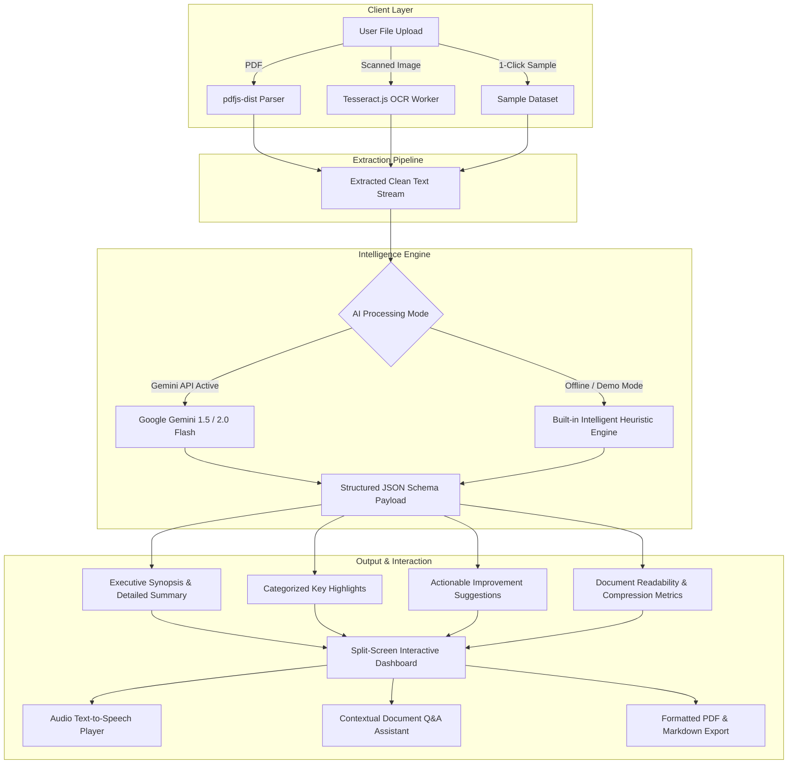

# 📑 Document Summary Assistant (DocuSummarizer AI)

<div align="center">


**A high-performance, client-side document intelligence platform that extracts text from PDFs & scanned images, generates multi-tier smart summaries, extracts categorized key points, and provides actionable document improvement suggestions.**

[Live Application](https://document-summary-assistant.vercel.app) • [GitHub Repository](https://github.com/dhanushh00/Document-Summary-Assistant) • [Approach Write-Up](#-technical-approach-write-up-200-words-max)

</div>

---

## 📌 Technical Approach Write-Up (200 Words Max)

> To deliver a responsive, zero-latency document summarization system, the architecture decouples text extraction from AI reasoning. Client-side extraction uses `pdfjs-dist` for layout-aware multi-page PDF parsing and `tesseract.js` web workers for local Optical Character Recognition (OCR) on scanned documents, providing real-time progress callbacks without heavy backend server overhead.
>
> The extracted text feeds into an AI processing pipeline integrated with Google Gemini 1.5/2.0 Flash via structured JSON prompting. The system synthesizes multi-tier summaries (**Short Executive**, **Medium Overview**, **In-Depth Analysis**) with domain-specific focus angles (**Executive**, **Action Items**, **Technical**). Beyond summarization, an automated editorial engine identifies document vulnerabilities (clarity, completeness, legal risk) to generate prioritized improvement recommendations.
>
> For resilience, an intelligent offline heuristic engine acts as an instant fallback when no API key is present, guaranteeing 100% testable functionality out-of-the-box. The frontend follows a glassmorphic dashboard architecture built with React, TypeScript, and Tailwind CSS, featuring split-screen verification, text-to-speech audio synthesis, contextual document Q&A, and PDF/Markdown export.

---

## 🎯 Technical Assessment Requirements & Evaluation Matrix

| Assessment Requirement | Implementation & Technical Architecture | Status |
| :--- | :--- | :---: |
| **1. Document Upload** | Drag-and-drop & native file picker supporting PDFs and scanned images (`.png`, `.jpg`, `.jpeg`, `.webp`, `.bmp`, `.tiff`) with size validation up to 25MB. | ✅ Complete |
| **2. PDF Text Extraction** | Client-side multi-page extraction preserving formatting, headings, and paragraph structure via `pdfjs-dist`. | ✅ Complete |
| **3. Image OCR Extraction** | Optical Character Recognition powered by `tesseract.js` with background web workers and real-time `0% → 100%` progress tracking. | ✅ Complete |
| **4. Multi-Depth Summaries** | **Short** (~60–90 words), **Medium** (~160–240 words), and **Long** (~400–600 words) depth options with configurable focus tones. | ✅ Complete |
| **5. Key Points & Entity Highlights** | Automatic extraction of critical takeaways tagged with categorized badges (*Financial, Risk, Timeline, Objective, Conclusion*). | ✅ Complete |
| **6. Improvement Suggestions** | Actionable document critique analyzing clarity, omissions, formatting, and legal risk with priority rankings (*High, Medium, Low*). | ✅ Complete |
| **7. Interactive Q&A Chat** | Contextual document assistant to ask questions grounded strictly in the uploaded document content. | ✅ Complete |
| **8. Voice Text-to-Speech** | Built-in voice player allowing users to listen to summaries out loud with speed and pause controls. | ✅ Complete |
| **9. Multi-Format Export** | Instant export to formatted **PDF** (`jsPDF`), **Markdown (.md)**, and one-click copy to clipboard. | ✅ Complete |
| **10. UI/UX & Responsiveness** | Sleek glassmorphic dark/light UI, responsive across mobile, tablet, and desktop viewports. | ✅ Complete |
| **11. Pre-Loaded Test Documents** | 4 pre-loaded real-world sample documents (NDA Contract, Research Paper, Series A Pitch Deck, Scanned Medical OCR). | ✅ Complete |
| **12. Cloud Hosting Ready** | Production-optimized build with deployment configurations for **Vercel** (`vercel.json`) and **Netlify** (`netlify.toml`). | ✅ Complete |

---

## 🏗️ Architectural Data Flow



---

## 🚀 Quick Start & Local Setup

### Prerequisites
- **Node.js**: `v18.0.0` or higher
- **npm** or **yarn** or **pnpm**

### Installation

1. **Clone the repository**:
   ```bash
   git clone https://github.com/dhanushh00/Document-Summary-Assistant.git
   cd Document-Summary-Assistant
   ```

2. **Install dependencies**:
   ```bash
   npm install
   ```

3. **Configure Environment Variables (Optional)**:
   Create a `.env` file in the root folder:
   ```env
   VITE_GEMINI_API_KEY=your_gemini_api_key_here
   ```
   *(The application includes an intelligent offline heuristic engine that functions automatically even without an API key).*

4. **Run the Development Server**:
   ```bash
   npm run dev
   ```
   Open your browser at `http://localhost:5173`.

5. **Build for Production**:
   ```bash
   npm run build
   ```

---

## 🌐 Deployment Guide (Vercel & Netlify)

### Deploy to Vercel (Recommended)
1. Log in to [Vercel](https://vercel.com) and click **"Add New Project"**.
2. Select and import **`dhanushh00/Document-Summary-Assistant`**.
3. (Optional) Under **Environment Variables**, add:
   - `VITE_GEMINI_API_KEY`: `your_api_key`
4. Click **Deploy**.

### Deploy to Netlify
1. Connect your repository to [Netlify](https://netlify.com).
2. Set Build Command to `npm run build` and Publish Directory to `dist`.
3. Click **Deploy Site**.

---

## 🧪 Pre-Loaded Sample Documents for Instant Evaluation

The application includes 4 pre-loaded real-world documents accessible in 1 click from the landing page:
1. **Mutual Non-Disclosure Agreement (NDA)** - Multi-page legal confidentiality agreement.
2. **AI Quantization Research Paper** - Peer-reviewed academic manuscript with methodology and empirical results.
3. **Series A Pitch Deck & Financial Memorandum** - Business traction, SaaS metrics, and investment deck.
4. **Scanned Clinical Lab Report** - Scanned diagnostic sheet demonstrating optical character recognition.

---

## 📂 Project Structure

```
├── public/                  # Static assets & SVG icons
├── src/
│   ├── components/          # Reusable UI components
│   │   ├── DocumentChat.tsx     # Contextual document Q&A assistant
│   │   ├── DocumentViewer.tsx   # Split-screen text viewer & search
│   │   ├── FileUpload.tsx       # Drag-and-drop zone with progress bar
│   │   ├── Navbar.tsx           # Brand header & theme toggle
│   │   ├── SummaryControls.tsx  # Length & focus mode selectors
│   │   └── SummaryDisplay.tsx   # Smart summaries, suggestions, TTS & PDF export
│   ├── data/
│   │   └── sampleDocuments.ts   # Pre-loaded test documents
│   ├── services/
│   │   ├── ocrExtractor.ts      # Tesseract.js OCR engine with worker progress
│   │   ├── pdfExtractor.ts      # PDF.js multi-page text extraction
│   │   └── summarizer.ts        # Gemini AI & smart offline fallback engine
│   ├── types/
│   │   └── index.ts             # TypeScript interfaces & types
│   ├── App.tsx              # Main dashboard application orchestrator
│   ├── index.css            # Tailwind CSS styling & animations
│   └── main.tsx             # React DOM entry point
├── netlify.toml             # Netlify deployment configuration
├── vercel.json              # Vercel deployment configuration
├── package.json             # Dependencies and build scripts
├── tsconfig.json            # TypeScript configuration
└── vite.config.ts           # Vite bundler configuration
```

---

## 📄 License
This project is open-source and licensed under the **MIT License**.
